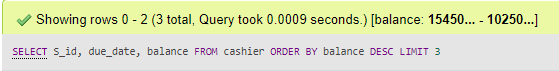
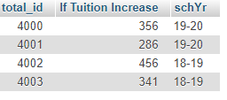
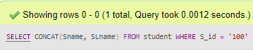
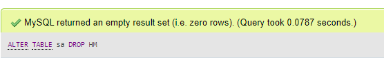

# THE-DATABASE
### GOAL 
Document your knowledge in Database. Show your advance SQL skill in showing complex information using simple queries. This can be handy as you move forward in your tech journey; you can always go back to this document whenever you feel uncertain or forget some techniques. This will also give insight to your future employer showing your base knowledge in SQL.
### DATABASE Documentation
## The Database

Student Management System is a database as well as a website where the student can check the status on his school. The student can easily check his financial status on how much is the remaining balance. Student subjects that are enrolled also subjects that not enrolled. The database can also check the students address if the student is at high-risk area or at lockdown. The Database made in a reason due to Covid19 in a practical way.  It is operated in a RDBMS (Relational Database Management System) called MySQL using the PhpMyAdmin platform.

### Entity Relationship Diagram (ERD)

ER diagram of the Student Management System shows the connection between entities and relationship of each table. The database created to make sure the capabilities of the database and to know how it works, in addition to show the simplicity of the user interface.  

The following markers used in the ERD defined as:  
- PK –Primary Key only
- FK- Foreign key only  

  

### The following tools that helped to create the database are the following:
[Lucid Chart Diagram tools] (https://online.visual-paradigm.com/)  [Mackaroo Mockup data] (https://lucid.app/)  

The data used on the database was get on this website [Mackaroo Mockup data] (https://lucid.app/).

### Table name and description
***Student table*** - is responsible for data storage on student’s name and last name as well as details and status. 
**Admin’s table** - is responsible for data storage on admin’s name and last name as well as details and status. 
**Address table** – is responsible for data storage on student and admin’s address. 
**IATF’s table** - is responsible for data storage on student and admin’s address status if it is high-risk, lockdown or not. 
**Quarantine table** - is responsible for data storage on student and admin’s health if he or she has Covid19. 
**Registrar table** - is responsible for data storage on student’s school requirements as well as the course and year. 
**Subjects table** - is responsible for data storage on student’s subjects. 
**Course table** - is responsible for data storage on student’s course. 
**Details table** - is responsible for data storage on student and admin’s details that includes personal email and phone number. 
**Status table** - is responsible for data storage on student’s status that includes if he or she is regular student, Student Assistant or scholarship from the government. 
**sa table** - is responsible for data storage if the student is a Student assistant or not and to check what department she is if she is a S.A. 
**Cashier table** - is responsible for data storage on student’s financial status, to check one’s balance. 
**Auto pay table** - is responsible for data storage if the student enrolled with auto pay or not, if she enrolled then the school will automatically deduct the balance using the card or checking account in file.  

# Functional Dependency Diagram (FDD)  

Functional Dependency Diagram (FDD) is a constraint that determines the relation of one attribute to another attribute in a Database Management System (DBMS). Functional Dependency helps to maintain the quality of data in the database. It plays a vital role to find the difference between good and bad database design.

   

 The diagram shows that each tables had undergone normalization removing all dependencies that can cause anomalies.  
 
# Complex Queries associated with the database  

### Here are a list of queries with their sample output from the DBRMS:  

### Query 1  
The purpose of the **SQL UNION query** is to combine the results of two queries together while removing duplicates. In other words, when using UNION, only unique values returned.    
**UNION query** is important for us so that we can easily unite any SELECT we will use and easier searching with multiple DATA.  

  

### Result:   
  

### Query 2  
The purpose of the **SQL UNION ALL** command is to combine the results of two queries together without removing any duplicates.   

**UNION ALL** is an important query which we can combine two queries together and to know all of the data you unite.  

  

### Result:   
  

### Query 3  
**Inline View**, nested within the FROM clause is referred as Inline View or Derived Table.   

**Inline view** sometimes referred to as derived table. These two terms are used interchangeably.  

  

### Result:   
  
### Query 4  
The **INTERSECT command in SQL** combines the results of two SQL statement and returns only data that are present in both SQL statements.   
**INTERSECT command** in SQL so that we will know the difference between the two data we compared.  

  

### Result:   
  

### Query 5  
The **MINUS or EXCEPT command** operates on two SQL statements. It takes all the results from the first SQL statement, and then subtract out the ones that are present in the second SQL statement to get the final result set. If the second SQL statement includes results not present in the first SQL statement, such results are ignored.   

**MINUS or EXCEPT command** is important so that we will know the difference from the first data we compared from the second data. 

  

### Result:   
  

### Query 6  
The **LIMIT **clause restricts the number of results returned from a SQL statement. It is available in MySQL.   

**LIMIT **clause is important for us to make sure how many data we will get or gather.  

  

### Result:   
  

### Query 7  

The usage of** WITH clause** is very similar to creating tables. When you create a table, you give it a name. Similarly, when you use the WITH clause, you also give it a name, and this name essentially acts like a table name in the main SQL statement.   
**WITH clause**does not create a table or a view, the object associated with the WITH statement disappears after the main SQL statement is executed, and there is nothing to clean up.  

  

### Result:   
  

### Query 8  
**EXISTS** is a Boolean operator used in a subquery to test whether the inner query returns any row. If it does, then the outer query proceeds. If not, the outer query does not execute, and the entire SQL statement returns nothing.   

**EXISTS** is important on our database so that we can easily compute or analyze big data. The formula will execute according to the inner query.  

  

### Result:   
  

### Query 9  

**CASE** is used to provide if-then-else type of logic to SQL. There are two formats: The first is a Simple CASE expression, where we compare an expression to static values. The second is a Searched CASE expression, where we compare an expression to one or more logical conditions.  
It is very important since we are always using if-then-else statement; it is a practical query especially for those people who are used to database. 

  

### Result:   
  

### Query 10  

The **CAST** function in SQL converts data from one data type to another. For example, we can use the CAST function to convert numeric data into character string data.    

This important since there are some numbers on our data that has point and we need to have an integer not a float.  

  

### Result:   
  

### Quer 11  

The **CONVERT function** in MySQL and SQL Server converts data from one data type to another.    
It is important since there are some data, that are float or it has point on it and we need to round off those data like grades. 
  

### Result:   
  

### Query 12  
The **Concatenate** function combines multiple character strings together. Each database provides its own way(s) to do this.    
It is important to **Concatenate** since there are some data that is separated and we need to combine it.  

  

### Result:   
  

### Query 13  
The **INSTR** function in SQL is used to find the starting location of a pattern in a string. This function is available in MySQL and Oracle, though they have slightly different syntaxes.    

To check on what area is the desired data to find, it will be use on locating data and to check how many data will counted.  

  

### Result:   
  

### Query 14  
The **Replace function in SQL** is used to update the content of a string. The function call is REPLACE( ) for MySQL, Oracle, and SQL Server.    

It is important since there are some data that we need to change if we forget something or we need to update.  

  

### Result:   
  

### Query 15  
The **AVG function** is use to find the average value in an expression.    
It is important to check the total average of some data, for example the total grade of your student.  

  

### Result:   
  

### Query 16  

The **COUNT function** in SQL is used to calculate the number of rows returned from the SQL statement.    
This is important because there are some time that we need to get the total data we place on a table.  

  

### Result:   
  
### Query 17  

The **MAX function** is used to find the maximum value in an expression.    
It is important since we need to know the total amount or value of the desired data.  

  

### Result:   
  

### Query 18  

To add a column to a table using SQL, we specify that we want to change the table structure via the **ALTER TABLE command**, followed by the ADD command to tell the RDBMS that we want to add a column.    

It is very important especially if we forgot a column on our table, ALTER TABLE will add another column automatically.   

### Result:  
  

### Query 19  

**Change Column** is not used in traditional RDBMS such as MySQL, Oracle, and SQL Server. In those environments, you can change the name of a column using the **ALTER TABLE RENAME COLUMN** command, and you can change the data type of a column using the ALTER TABLE MODIFY COLUMN comnmand.    

It is important if the data we collected is not connected with the column name we input, so we can change it using the** ALTER TABLE MODIFY COLUMN.**

### Result:  
  

### Query 20  

**ALTER TABLE command**, followed by a specification indicating that we want to **remove a column**.    

Sometimes we will wish to delete a column from an existing table in SQL. To do this, we specify that we want to change the table structure via the ALTER TABLE command, followed by a specification indicating that we want to remove a column.  
### Result:  
  

 
 
 
 
 
 
 
 
 
 
 
 
 
 
 
 
 
 
 
 
 
 
 
 
 
 
 

 

 
